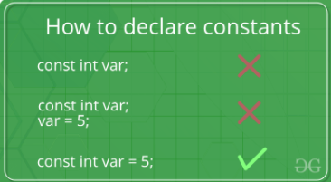

# const possible usages

const keyword is attached with any method(), variable, pointer variable, and with the object of a class it prevents that specific

## Constant Variables:
There are a certain set of rules for the declaration and initialization of the constant variables:

 

## Const Keyword With Pointer Variables:
 Pointers can be declared with a const keyword. So, there are three possible ways to use a const keyword with a pointer, which are as follows:

### When the pointer variable point to a const value:

### Syntax: 
```c++
const data_type* var_name;
```

### When the const pointer variable point to the value:

### Syntax:
```c++
data_type* const var_name;
```

### When const pointer pointing to a const variable:

### Syntax:
```c++
const data_type* const var_name;
```

## Constant Methods:


Like member functions and member function arguments, the objects of a class can also be declared as const. An object declared as const cannot be modified and hence, can invoke only const member functions as these functions ensure not to modify the object.

### Syntax:
```c++
const Class_Name Object_name;
```
When a function is declared as const, it can be called on any type of object, const object as well as non-const objects.
Whenever an object is declared as const, it needs to be initialized at the time of declaration. However, the object initialization while declaring is possible only with the help of constructors.


# (&) operator possibl usages
The & symbol is used as an operator in C++. It is used in different places, this is the better-known useges:
- & as a bit-wise operator
- & to get the address of a variable
- & to declare a reference to a type
- && in a conditional expression

## Bitwise AND
The bitwise AND operator (&) compares each bit of the first operand to that bit of the second operand. If both bits are 1, the bit is set to 1. Otherwise, the bit is set to 0. Both operands to the bitwise AND operator must be of integral types.


### Ex.:
```c++
int a = 5, b = 9;   // a = 5(00000101), b = 9(00001001)
cout << (a & b);   //  00000001
```
### Output
This gives the output:

```c++
1
```

## Address Of operator
C++ provides two-pointer operators, which are Address of Operator (&) and Indirection Operator (*).

The address of Operator (&), and it is the complement of *. It is a unary operator that returns the address of the variable(r-value) specified by its operand. For example:
```c++
int  var;
int  *ptr;
int  val;

var = 3000;

// take the address of var
ptr = &var;

// take the value available at ptr
val = *ptr;
cout << "Value of var :" << var << endl;
cout << "Value of ptr :" << ptr << endl;
cout << "Value of val :" << val << endl;
```
### Output
This gives the output:
```c++
Value of var :3000
Value of ptr :0xbff64494
Value of val :3000
```
## Declare a Refrenceto a type

If you use & in the left-hand side of a variable declaration, it means that you expect to have a reference to the declared type. It can be used in any type of declarations (local variables, class members, method parameters).

Ex.:
```c++
string s = "Hello, wordl";
string& r = s; // Here, r is a reference to s
    
cout << s << endl;
cout << r << endl;
```
### Output
This gives the output:
```c++
Hello, wordl
Hello, wordl
```

This doesn't just mean that both **s** and **r** will have the same value, but they will actually point to the same place in the memory. 

## Conditional expression

&& in a (logical) expression is just the C-style way to say and. That's it.
